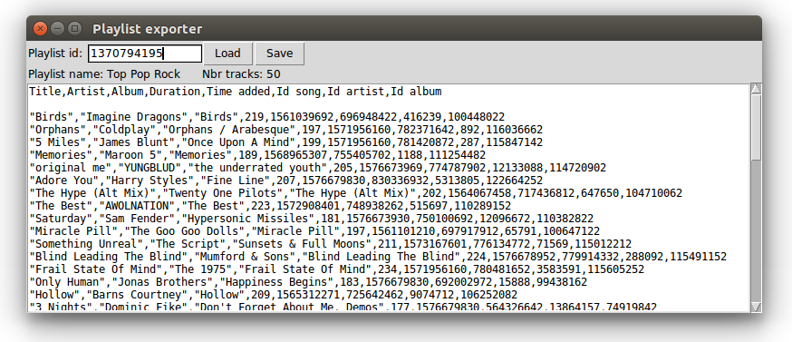

# Playlist exporter



Small script to export Deezer playlists to CSV files.

## Dependencies
The script uses `tkinter` for the GUI, and `requests` for the HTTP request.

```
pip install requests --user
sudo apt install python3-tk
```
